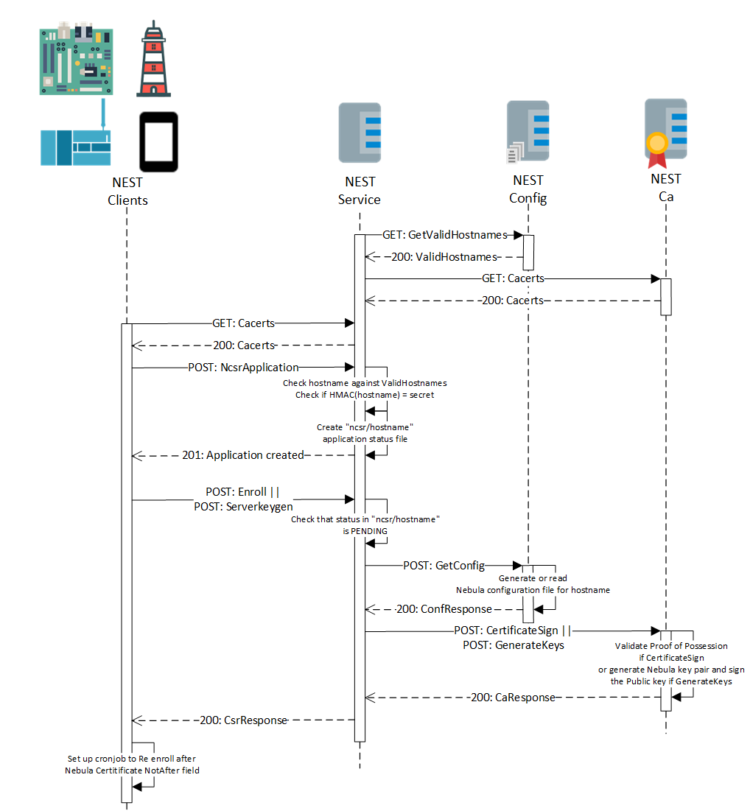
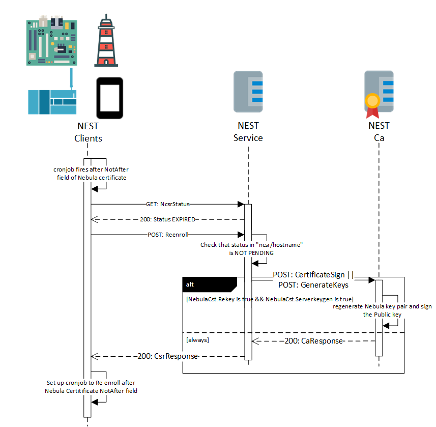

# NEST: Enrollment over Secure Transport[RFC7030] implementation for Nebula Mesh VPN Certificates

This repo proposes a simple and automated certificate and configuration management system for [Nebula Mesh VPN](https://github.com/slackhq/nebula) certificates, based on the Enrollment over Secure Transport standard [[RFC 7030](https://www.rfc-editor.org/rfc/rfc7030.html)].

## Use Case

A Client who wants to establish a Nebula Mesh VPN has no officially provided way to automatically provision CA signed Nebula certificates and configuration files to the future end nodes of the network. Instead, he/she should rely on manual deployment or secure copy (scp) of such files, implying human intervention is mandatory. The hereby proposed system wants to achieve this distribution in an automated and secure way, insuring an authenticated, tamper-proof and confidential exchange of these crucial files in order to ensure that only the authorized hosts will join the secure Nebula network, using the intended configurations. This system could help set-up a
Nebula Mesh VPN in an Industrial Control System (or IIoT) settings, i.e., deploying the Nebula certs. and configs. on PLCs (programmable logic controllers), SBC (Single Board Computers, i.e., Raspberry Pis) and EWS (Engineering Workstations), to create secure, peer to peer networks between these crucial assets, that will communicate over secure and isolated channels instead of the probably unsecure and unsegregated OT network. It can also help enforce Zero Trust principles by leveraging the identity-based routing and communication infrastructure provided by the Nebula Mesh VPN.

System Architecture


Clients will access the NEST service through requests to REST API endpoints over a secure transport. Server side authentication will be provided by a typical x509 certificate, which can be self signed or signed by a private CA already present in the corporate network. Either way, the CA certificate useful to verify the message sent by the NEST service will be provided at deployment time to the clients. For condidentiality, one of these TLS ciphers will be used:

- [TLS_ECDHE_ECDSA_WITH_AES_256_GCM_SHA384](https://ciphersuite.info/cs/TLS_ECDHE_ECDSA_WITH_AES_256_GCM_SHA384/)

- [TLS_ECDHE_ECDSA_WITH_CHACHA20_POLY1305_SHA256](https://ciphersuite.info/cs/TLS_ECDHE_ECDSA_WITH_CHACHA20_POLY1305_SHA256)

These ciphers have been chosen because, other than being recommended by NIST best practices and being supported by the current TLS standard ([TLS.13](https://datatracker.ietf.org/doc/html/rfc8446)), the same AEADs are used by Nebula, so the clients already have to implement it. Client authentication will be acheived sending a secret to the NEST service as the first message in a enrollment session. This secret will be built by using a HMAC function ([RFC 2104: HMAC: Keyed-Hashing for Message Authentication](https://www.rfc-editor.org/rfc/rfc2104)). The HMAC of the nebula hostname of the client will be created using a secret NEST service key, and will be provided at deployment time to the clients. In this way, no key has to be pre-shared between clients and services, enabling client authentication on the NEST service, that will have only to verify the client-provided HMAC with his secret key locally.

The NEST service will act as a facade between the NEST clients and other two services, created to separate responsibilities, the NEST Certificate Authority (that will handle Nebula certificate signing and creation) and the NEST config service (that will handle the Nebula configuration files creation). Mutual authentication and confidentiality between these services will be provided by the fact that these services will be exposed over an already established Nebula Mesh network.

These 2 services will also be impleemented as REST API servers. Documentation for the REST API has been redacted following the OpenAPI 3.0.3 standard and a rendered version is provided in the attached pdfs:

- NEST service OpenAPI documentation:
  
  - [Rendered version](./docs/NEST service OpenAPI docs.pdf)
  
  - [YAML version](./app/nest_service/api/nebula_est-openapi.yaml)

- NEST CA OpenAPI documentation:
  
  - [Rendered version](./docs/NEST CA OpenAPI docs.pdf)
  
  - [YAML version](./app/nest_service/api/nebula_ca-openapi.yaml)

- NEST config OpenAPI documentation:
  
  - [Rendered version](./docs/NEST config OpenAPI docs.pdf)
  
  - [YAML version](./app/nest_service/api/nebula_config-openapi.yaml)

Moreover, the NEST CA service will be implemented by leveraging the nebula-cert] binary to sign Nebula certificates or to create Nebula key pairs; similarly, the nebula-dhall binary file developed for a previous thesys will be used by the NEST config service to automatically generate Nebula configuration files leveraging one single Dhall configuration file.

The Go language has been chosen as the System implementation language, as Nebula is written in Go (so Go packages of that project can be automatically imported and their function used) and Dhall has API for the Go language to parse dhall configuration files into Go programs.

## System Model

### NestAuth

```go
//The NEST authentication object sent by the NEST client to the NEST service as first the message
type NestAuth struct {
    //The future hostname of the client in the Nebula network
    Hostname string `json:"Hostname,omitempty"`
    //The HMAC of the hostname, to be verified by the NEST service
    Secret []byte `json:"Secret,omitempty"`
}
```

### NebulaCsr

```go
//A Nebula certificate signing request, sent by the client to the NEST service
// and relayed to the NEST CA
type NebulaCsr struct {
    //Indicates if the Nebula key pair has to be generated on the server or not
    ServerKeygen bool `json:"serverKeygen,omitempty"`
    //Used in re-enrollment CSRs. Indicates if the Nebula key pair has to be regenerated for the new Nebula certificate.
    Rekey bool `json:"rekey,omitempty"`
    //The hostname of the requesting client
    Hostname string `json:"hostname"`
    //Byte stream indicating the client-generated publicKey. Can be omitted if serverKeygen is true
    PublicKey []byte `json:"publicKey,omitempty"`
    //Proof of Possession of the private key associated to the provided publicKey
    Pop []byte `json:"POP,omitempty"`
    //Nebula security groups the client will be part of. Populated by the NEST service after requesting this
    // information to the NEST config service. Needed by the NEST CA to generate the Nebula certificate
    Groups []string `json:"Groups,omitempty"`
    //Nebula Ip of the client. Populated by the NEST service after requesting this
    // information to the NEST config service. Needed by the NEST CA to generate the Nebula certificate
    Ip string `json:"ip,omitempty"`
}
```

### NebulaCsrResponse

```go
import ("github.com/slackhq/nebula/cert")

//Response returned by the NEST service to the NEST client
type NebulaCsrResponse struct {
    //The newly generated Nebula Certificate
    NebulaCert cert.NebulaCertificate `json:"NebulaCert"`
    //The newly generated Nebula private key. Omitted if serverKeygen is false on the NebulaCsr
    NebulaPrivateKey []byte `json:"NebulaPrivateKey,omitempty"`
    //The newly generated Nebula configuration file. Omitted for re-enrollment CSRs 
    NebulaConf []byte `json:"NebulaConf,omitempty"`
    //The client-local path in which the configuration file and nebula certificate has to be installed
    NebulaPath string `json:"NebulaPath,omitempty"`
}
```

## CaResponse

```go
import ("github.com/slackhq/nebula/cert")

//Response returned by the Nebula CA to the NEST service
type CaResponse struct {
    //The newly generated Nebula Certificate
    NebulaCert cert.NebulaCertificate `json:"NebulaCert"`
    //The newly generated Nebula private key. Omitted if serverKeygen is false on the NebulaCsr
    NebulaPrivateKey []byte `json:"NebulaPrivateKey,omitempty"`
}
```

## ConfResponse

```go
//Response returned by the Nebula config service to the NEST service
type ConfResponse struct {
    //The newly generated Nebula configuration file.
    NebulaConf []byte `json:"nebulaConf,omitempty"`
    //Nebula security groups the client will be part of.
    Groups []string `json:"groups,omitempty"`
    //Nebula Ip of the client.
    Ip string `json:"ip,omitempty"`
    //The client-local path in which the configuration file and nebula certificate has to be installed
    NebulaPath string `json:"NebulaPath"`
}
```

## ApiError

```go
type ApiError struct {
    //HTTP status code
    Code int32 `json:"code"`
    //Error message
    Message string `json:"message"`
}
```

## Full enrollment session



This sequence diagram shows a successful enrollment session by a client, both in Serverkeygen mode (Nebula key pairs generated by the NEST CA service and then returned to the client) and simple enroll (by generating Nebula keys client-side and sending the Public key to be signed to the Nebula CA, which will then create the certificate). The arrows contain the HTTP Method used and the name of the REST API endpoint as can be found in the documentation.

## Re-enrollment session



This sequence diagram shows a Re-enrollment session by the client. This can be done either if the client certificate has expired, or for some reason the certificate has been compromised. The Nebula Certificate Signing Request for this sesion can also provide a boolean field (the Rekey field), that tells the NEST service that the client doesn't want a simple time extension of the previous certificate, but wants to recreate the cryptographic material associated to it, thus generating a new Nebula Certificate.

## Project structure

- `nest_ca`
  
  - `api`: folder containing the documentation for this service's REST API
  
  - `build`: target folder for compiled files
  
  - `cmd`: folder containing the main entrypoint for this service
  
  - `pkg`: folder containing public code used throughout the module, and exported in the workspace
    
    - `logic`: buisness logic for this service
  
  - `test`: folder containing service files for testing purposes

- `nest_config`
  
  - `api`: folder containing the documentation for this service's REST API
  
  - `build`: target folder for compiled files
  
  - `cmd`: folder containing the main entrypoint for this service
  
  - `pkg`: folder containing public code used throughout the module, and exported in the workspace
    
    - `logic`: buisness logic for this service
  
  - `test`: folder containing service files for testing purposes

- `nest_service`
  
  - `api`: folder containing the documentation for this service's REST API
  
  - `build`: target folder for compiled files
  
  - `cmd`: folder containing the main entrypoint for this service
  
  - `pkg`: folder containing public code used throughout the module, and exported in the workspace
    
    - `models`: folder containing the system model
    
    - `utils`: miscellaneous utilities
    
    - `logic`: buisness logic for this service
  
  - `test`:  folder containing service files for testing purposes and testing utilities for the workspace

- `nest_client`
  
  - `build`: target folder for compiled files
  
  - `cmd`: folder containing the main entrypoint for this client

- `docs`: general documetation for the project

- `examples`: configuration files examples for the system

## Installation

To build NEST from source just run

```bash
./nest_build.sh
```

from the root directory of the project (where the go.work file is).

4 executables will be compiled and saved into the build directory (one for each service and one for the client).

If you want to deploy the NEST system using Docker, and you want to build the Docker images by yourself, then 
you have to run the

```bash
go build -o ./build cmd/*
```

command from all the root directories of each project module (e.g. nest_service, nest_config, nest_ca, nest_client).
This will create a binary file in each build/ subdirectory of each go module. Then, still from the root directory of each module, you can run the

```bash
docker build -t <module_name> .
e.g.
docker build -t nest_service .
```

command to build a local docker image of each service/client.

To automate this procedure, the `nest_build_docker.sh` script is provided.

## Deployment

A bash file will be provided for the preparation of the deployment environment using docker. In this section a full documentation of the config environment that mirros the `nest_deployment.sh` file is provided.

Create a configs folder and a subfolder for each service and client of the system, e.g.:

```bash
configs/
--- nest_service/
--- nest_ca/
--- nest_config/
--- nest_client/
```

Let's create a Nebula Configuration Autority for the NEST system Nebula network:

```bash
wget https://github.com/slackhq/nebula/releases/download/v1.6.1/nebula-linux-amd64.tar.gz && tar -xzvf  nebula-linux-amd64.tar.gz && rm nebula-linux-amd64.tar.gz
nebula-cert ca -name "nest_system_ca" -out-crt nest_system_ca.crt -out-key nest_system_ca.key
```

### nest_ca

Enter the `nest_ca/` directory. Create a directory for the logs, one that will store the configuration files, and one that will store the generated NEST client's Nebula certificates, e.g.:

```bash
nest_ca/
--- log/
--- config/
--- certificates/
```

From the `config/` subdirectory, let's create a `bin/` directory that will hold the `nebula-cert` binary to be used be the nebula_ca and copy the nebula-cert binary:

```bash
mkdir bin && cd bin
cp ../../../nebula-cert .
```

Then, from the `config/` subdirectory, let's create a `keys/` folder that will hold the nest_ca Nebula key pair, and generate them.

```bash
mkdir keys && cd keys
../bin/nebula-cert ca -name "ca" -out-crt ca.crt -out-key ca.key
```

Finally, from the `config/` subdirectory, let's create a `nebula/` folder that will hold the configuration files for the nest_ca host in the NEST system Nebula network and enter it.

Let's copy the NEST system Nebula CA cert and nebula binary in this folder and create the nebula key pair for the nest_service host:

```bash
mkdir nebula && cd nebula
cp ../../../nest_system_ca.crt ../../../nebula .
../bin/nebula-cert sign -ip 192.168.80.1/24 -name nest_ca -ca-key ../../nest_system_ca.key -ca-crt nest_system_ca.crt
```

The config.yml Nebula configuration file will be created with the dhall-nebula tool. The configuration files to make it work are provided in the `examples` directory of the project. (Forse, poi tutorial su cosa cambiare nei dhall files per fare andare la proprio rete custom).

### nest_config

Enter the `nest_config/` directory. Create a directory for the logs, one that will store the configuration files and one that will store the dhall configuration files, e.g.:

```bash
nest_config/
--- log/
--- config/
--- dhall/
```

Then, from the `dhall/` subdirectory,let's copy all the contents of the `examples/NEST client Nebula network configuration` folder. This will be a basis on which change the dhall configuration files in order to reflect what the NEST client Nebula network will be. For example, the `dhall/nebula/hosts/` directory will host dhall configuration files for each client host that will participate in the client network. Take a look at the example files to understand how the file is structured. You will have to create files with the same structure, name them "yourclientname.dhall" and change the configuration of the nebula.Host dhall type to match your desired client. Then, you will have to update the `dhall/nebula/nebula_conf.dhall` file in order to take into account your new host files (add them adding a new let <yourclientname> = <yourclientpath> line to the file) and information on your nebula network (groups, firewall connections, etc). (Tutorial su come cambiare i dhall files a fine readme ?)

Finally, from the `config/` subdirectory, let's create a `nebula/` folder that will hold the configuration files for the NEST host in the NEST system Nebula network and enter it.

Let's copy the NEST system Nebula CA cert and nebula binaries in this folder and create the nebula key pair for the nest_service host:

```bash
mkdir nebula && cd nebula
cp ../../../nest_system_ca.crt ../../../nebula .
../../../nebula-cert sign -ip 192.168.80.2/24 -name nest_config -ca-key ../../../nest_system_ca.key -ca-crt nest_system_ca.crt
```

The config.yml Nebula configuration file will be created with the dhall-nebula tool. The configuration files to make it work are provided in the `examples` directory of the project. (Forse, poi tutorial su cosa cambiare nei dhall files per fare andare la proprio rete custom).

### nest_service

Enter the `nest_service/` directory. Create a directory for the logs and one that will store the configuration files, e.g.:

```bash
nest_service/
--- log/
--- config/
```

First of all, we have to create the tls key pairs for the nest_service. Create a folder in the `config/` subfolder that will host the tls cryptografic material (e.g. `tls/`) and enter it.

If you want a self signed certificate:

```bash
openssl ecparam -name secp256k1 -genkey -noout -out nest_service-key.pem
openssl req -new -x509 -key nest_service-key.pem -out nest_service-crt.pem -days 365
```

If you already have an internal Certificate Authority, you need to create the key pair and a Certificate Signing Request to be signed by the CA:

```bash
openssl ecparam -name secp256k1 -genkey -noout -out nest_service-key.pem
openssl req -new -sha256 -key nest_service-key.pem -out nest_service.csr
openssl x509 -signkey <path-to-the-ca-key> -in nest_service.csr -req -days 365 -out nest_service-crt.pem
```

In both cases you will be prompted to insert some information about your new certificate

Then, from the `config/` subdirectory, let's create a `nebula/` folder that will hold the configuration files for the nest_serivce host in the NEST system Nebula network and enter it.

Let's copy the NEST system Nebula CA cert in this folder and create the nebula key pair for the nest_service host:

```bash
mkdir nebula && cd nebula
cp ../../../nest_system_ca.crt ../../../nebula .
../../../nebula-cert sign -ip 192.168.80.3/24 -name nest_service -ca-key ../../../nest_system_ca.key -ca-crt nest_system_ca.crt
```

The config.yml Nebula configuration file will be created with the dhall-nebula tool. The configuration files to make it work are provided in the `examples` directory of the project. (Forse, poi tutorial su cosa cambiare nei dhall files per fare andare la proprio rete custom).

Finally, in the `config/` subdirectory, let's create the nest_service key to create and verify the NEST client's secret hmac.

```bash
 head /dev/urandom | sha256sum > hmac.key
```

## Documentation

Please check out this module documentation by installing godoc

```bash
go install -v golang.org/x/tools/cmd/godoc@latest
```

and running a local instance of godoc on your system

```bash
godoc -http=127.0.0.1:6060
```

and visiting *http://localhost:6060/pkg/github.com/m4rkdc/nebula_est/* 
